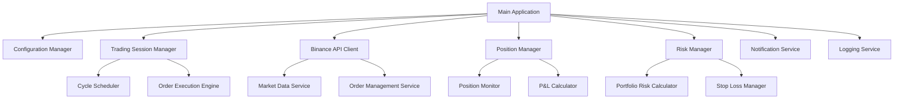
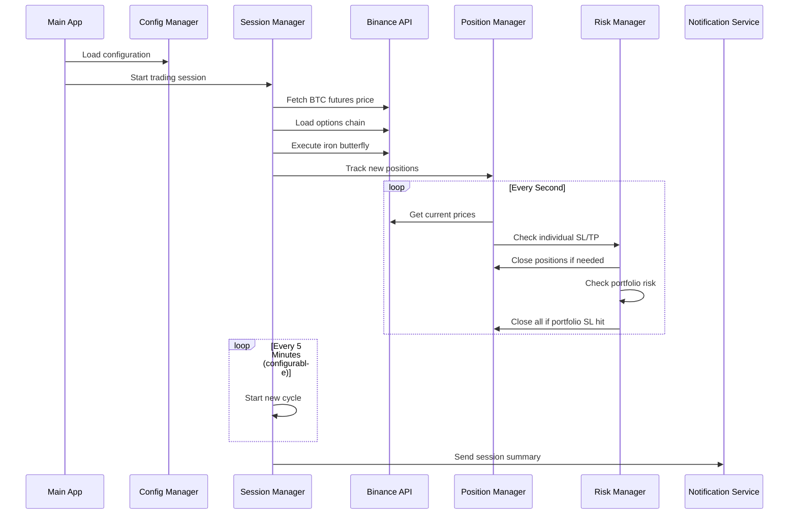

# Design Document

## Overview

The BTC Options Straddle Bot is a Java-based automated trading system that executes iron butterfly strategies on Binance Options. The system operates within configurable time windows, manages multiple trading cycles, and implements comprehensive risk management with real-time position monitoring.

## Architecture

### High-Level Architecture



### Component Interaction Flow



## Components and Interfaces

### 1. Configuration Manager

**Purpose**: Manages all configuration parameters from external config file.

**Key Classes**:
- `TradingConfig`: Main configuration class
- `ConfigLoader`: Loads and validates configuration

**Configuration Structure**:
```java
public class TradingConfig {
    // API Configuration
    private String apiKey;
    private String secretKey;
    
    // Session Configuration
    private LocalTime sessionStartTime;
    private LocalTime sessionEndTime;
    
    // Trading Parameters
    private int cycleIntervalMinutes;
    private int numberOfCycles;
    private BigDecimal positionQuantity;
    private int strikeDistance;
    
    // Risk Management
    private double stopLossPercentage;
    private double profitTargetPercentage;
    private double portfolioRiskPercentage;
    
    // Notification Configuration
    private String telegramBotToken;
    private String telegramChatId;
}
```

### 2. Binance API Client

**Purpose**: Handles all interactions with Binance Options API.

**Key Classes**:
- `BinanceOptionsClient`: Main API client
- `MarketDataService`: Fetches market data
- `OrderService`: Manages order operations
- `AuthenticationService`: Handles API authentication

**Key Methods**:
```java
public interface BinanceOptionsClient {
    BigDecimal getBTCFuturesPrice();
    List<OptionContract> getOptionsChain(LocalDate expiry);
    OrderResponse placeOrder(OrderRequest request);
    OrderResponse modifyOrder(String orderId, OrderModifyRequest request);
    OrderResponse cancelOrder(String orderId);
    List<Position> getPositions();
    OrderBook getOrderBook(String symbol, int depth);
}
```

### 3. Trading Session Manager

**Purpose**: Orchestrates the entire trading session and cycle management.

**Key Classes**:
- `TradingSessionManager`: Main session controller
- `CycleScheduler`: Manages trading cycles
- `IronButterflyExecutor`: Executes iron butterfly strategies

**Key Methods**:
```java
public class TradingSessionManager {
    public void startSession();
    public void executeTradingCycle();
    public void stopSession();
    private void waitForSessionStart();
    private boolean isSessionActive();
}
```

### 4. Order Execution Engine

**Purpose**: Handles order placement and aggressive fill logic.

**Key Classes**:
- `OrderExecutor`: Main order execution logic
- `AggressiveFillStrategy`: Implements market-like order filling
- `OrderMonitor`: Monitors unfilled orders

**Aggressive Fill Strategy**:
```java
public class AggressiveFillStrategy {
    public void executeOrder(OrderRequest order) {
        // Initial placement at bid/ask
        // Monitor for 1 second
        // If not filled, modify with deeper prices
        // Continue for up to 1 minute
        // Send Telegram alert if not filled
    }
    
    private BigDecimal getAggressivePrice(OrderSide side, OrderBook orderBook) {
        // For sells: use bid price or lower
        // For buys: use ask price or higher
        // Go deeper into order book if needed
    }
}
```

### 5. Position Manager

**Purpose**: Tracks and manages all open positions.

**Key Classes**:
- `PositionManager`: Main position tracking
- `IronButterflyPosition`: Represents iron butterfly position
- `PositionMonitor`: Real-time position monitoring

**Data Structure**:
```java
public class IronButterflyPosition {
    private String positionId;
    private LocalDateTime creationTime;
    private BigDecimal atmStrike;
    private OptionLeg sellCall;
    private OptionLeg sellPut;
    private OptionLeg buyCall;
    private OptionLeg buyPut;
    private BigDecimal maxTheoreticalLoss;
    private BigDecimal currentPnL;
    private PositionStatus status;
}

public class OptionLeg {
    private String symbol;
    private OptionType type; // CALL or PUT
    private BigDecimal strike;
    private BigDecimal quantity;
    private BigDecimal entryPrice;
    private BigDecimal currentPrice;
    private OrderSide side; // BUY or SELL
}
```

### 6. Risk Manager

**Purpose**: Implements all risk management rules.

**Key Classes**:
- `RiskManager`: Main risk management controller
- `PositionRiskCalculator`: Individual position risk
- `PortfolioRiskCalculator`: Portfolio-level risk
- `StopLossManager`: Executes stop-loss orders

**Risk Calculation Logic**:
```java
public class PortfolioRiskCalculator {
    public BigDecimal calculateMaxTheoreticalLoss(List<IronButterflyPosition> positions) {
        // Sum max theoretical loss of all iron butterflies
        // Max loss = (strike distance * quantity) - net premium received
    }
    
    public BigDecimal calculateCurrentMTM(List<IronButterflyPosition> positions) {
        // Calculate current mark-to-market using live prices
    }
    
    public boolean shouldTriggerPortfolioStopLoss(BigDecimal currentMTM, BigDecimal maxLoss) {
        return currentMTM.compareTo(maxLoss.multiply(BigDecimal.valueOf(0.1))) >= 0;
    }
}
```

### 7. Notification Service

**Purpose**: Handles Telegram notifications and alerts.

**Key Classes**:
- `TelegramNotificationService`: Telegram integration
- `NotificationFormatter`: Formats messages
- `AlertManager`: Manages different alert types

## Data Models

### Core Entities

```java
public enum OptionType {
    CALL, PUT
}

public enum OrderSide {
    BUY, SELL
}

public enum PositionStatus {
    OPEN, CLOSED_PROFIT, CLOSED_LOSS, CLOSED_RISK
}

public class OptionContract {
    private String symbol;
    private OptionType type;
    private BigDecimal strike;
    private LocalDate expiry;
    private BigDecimal bidPrice;
    private BigDecimal askPrice;
    private BigDecimal bidQuantity;
    private BigDecimal askQuantity;
}

public class OrderRequest {
    private String symbol;
    private OrderSide side;
    private BigDecimal quantity;
    private BigDecimal price;
    private OrderType type; // LIMIT
}

public class OrderResponse {
    private String orderId;
    private String symbol;
    private OrderStatus status;
    private BigDecimal filledQuantity;
    private BigDecimal avgPrice;
    private LocalDateTime timestamp;
}
```

## Error Handling

### Exception Hierarchy

```java
public class TradingBotException extends Exception {
    // Base exception class
}

public class APIException extends TradingBotException {
    // Binance API related errors
}

public class ConfigurationException extends TradingBotException {
    // Configuration loading errors
}

public class RiskManagementException extends TradingBotException {
    // Risk management violations
}

public class OrderExecutionException extends TradingBotException {
    // Order placement/modification errors
}
```

### Error Handling Strategy

1. **API Failures**: Retry with exponential backoff (max 3 attempts)
2. **Order Failures**: Log error, send Telegram alert, continue with next cycle
3. **Configuration Errors**: Log error and exit application
4. **Risk Violations**: Immediately close positions and send alerts
5. **Network Issues**: Implement circuit breaker pattern

### Retry Logic

```java
public class RetryHandler {
    private static final int MAX_RETRIES = 3;
    private static final long INITIAL_DELAY = 1000; // 1 second
    
    public <T> T executeWithRetry(Supplier<T> operation) throws APIException {
        // Exponential backoff retry logic
        // 1s, 2s, 4s delays
    }
}
```

## Testing Strategy

### Unit Testing

1. **Configuration Loading**: Test all config scenarios including missing values
2. **API Client**: Mock Binance API responses for all endpoints
3. **Risk Calculations**: Test portfolio and position risk calculations
4. **Order Logic**: Test aggressive fill strategy with various market conditions
5. **Position Management**: Test P&L calculations and position lifecycle

### Integration Testing

1. **API Integration**: Test with Binance testnet
2. **End-to-End Cycles**: Test complete trading cycles
3. **Risk Management**: Test stop-loss triggers
4. **Notification System**: Test Telegram integration

### Test Data

```java
public class TestDataBuilder {
    public static OptionContract createATMCall(BigDecimal strike) {
        // Create test option contracts
    }
    
    public static IronButterflyPosition createTestPosition() {
        // Create test iron butterfly positions
    }
    
    public static TradingConfig createTestConfig() {
        // Create test configuration
    }
}
```

### Performance Testing

1. **API Response Times**: Ensure sub-second response times
2. **Position Monitoring**: Test 1-second monitoring loop performance
3. **Memory Usage**: Monitor memory consumption during long sessions
4. **Concurrent Operations**: Test simultaneous API calls

## Security Considerations

### API Security

1. **Credential Storage**: Store API keys in encrypted configuration
2. **Request Signing**: Implement proper HMAC-SHA256 signing
3. **Rate Limiting**: Respect Binance API rate limits
4. **IP Whitelisting**: Use IP restrictions on Binance account

### Application Security

1. **Input Validation**: Validate all configuration parameters
2. **Logging Security**: Avoid logging sensitive information
3. **Error Messages**: Don't expose internal details in error messages
4. **Dependency Management**: Keep dependencies updated

## Deployment Considerations

### Environment Setup

1. **Java Version**: Java 11 or higher
2. **Dependencies**: Spring Boot, Jackson, OkHttp, SLF4J
3. **Configuration**: External config file (not in JAR)
4. **Logging**: Configurable log levels and file rotation

### Monitoring

1. **Application Metrics**: JVM metrics, API call counts, error rates
2. **Business Metrics**: Number of positions, P&L, success rates
3. **Health Checks**: API connectivity, configuration validity
4. **Alerting**: Integration with monitoring systems

### Scalability

1. **Single Instance**: Designed for single-instance deployment
2. **Resource Usage**: Minimal CPU and memory requirements
3. **Database**: No database required (stateless design)
4. **Backup**: Configuration and log file backup strategy